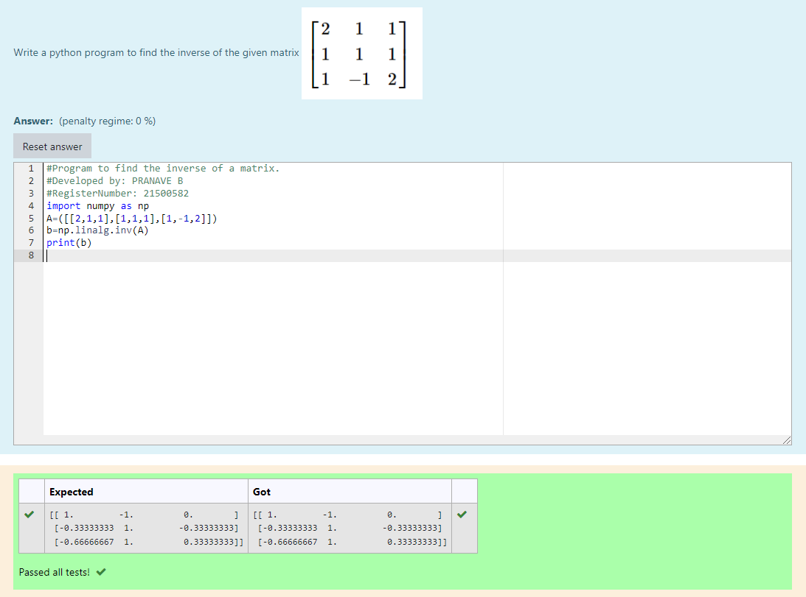

# INVERSE-OF-A-MATRIX
## Aim:
To write a python program to find the inverse of a matrix
## Equipment’s required:
1. 	Hardware – PCs
2. 	Anaconda – Python 3.7 Installation / Moodle-Code Runner
## Algorithm:
### Step1 : 
Start the program
### Step 2: 
Import numpy module as np
### Step 3: 
Assign the given values in the formula
### Step 4: 
Run the program
## Program:
~~~

#Program to find the inverse of a matrix.
#Developed by: PRANAVE B
#RegisterNumber: 21500582
import numpy as np
A=([[2,1,1],[1,1,1],[1,-1,2]])
b=np.linalg.inv(A)
print(b)
~~~
## Output:

## Result:
Thus the inverse of given matrix is successfully solved using python program

